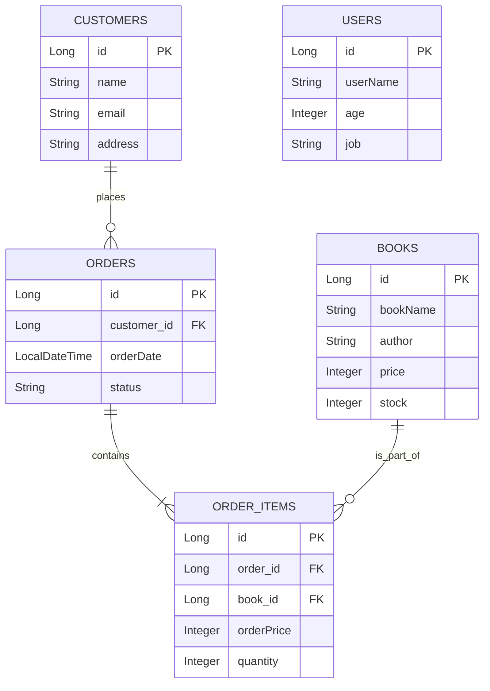
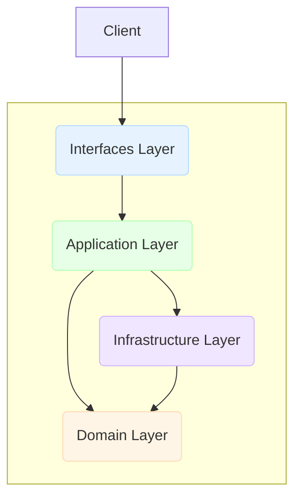

# DDD 기반 Spring Boot JPA 예제

이 프로젝트는 도메인 주도 설계(Domain-Driven Design, DDD) 원칙을 적용하여 구현한 간단한 주문 시스템 예제입니다. Spring Boot, JPA(Hibernate), PostgreSQL을 사용합니다.

## 📚 1. 도메인 모델

-   **User**: 시스템 사용자
-   **Customer**: 주문을 하는 고객
-   **Book**: 판매되는 책
-   **Order**: 주문 애그리거트(Aggregate)의 루트(Root)로서, 여러 `OrderItem`을 포함합니다.

### 테이블 관계도 (ERD)



---

## 🏗️ 2. DDD 아키텍처

이 프로젝트는 4개의 주요 계층(Layer)으로 구성된 계층형 아키텍처를 따릅니다.



### 🧩 계층별 역할

1.  **Interfaces Layer (프레젠테이션 계층)**
    -   **역할**: 외부 요청(HTTP)을 수신하고 응답을 반환합니다. DTO(Data Transfer Object)를 사용하여 내부 도메인 모델의 노출을 방지합니다.
    -   **구현**: Spring MVC를 사용한 REST 컨트롤러 (`@RestController`).
    -   **위치**: `com.bootcamp.employee.interfaces`

2.  **Application Layer (응용 계층)**
    -   **역할**: 사용자의 유스케이스(Use Case)를 오케스트레이션합니다. 도메인 객체와 인프라스트럭처 계층을 사용하여 비즈니스 로직을 조정하고, 트랜잭션의 경계를 설정합니다.
    -   **구현**: `@Service` 어노테이션을 사용한 서비스 클래스. `@Transactional`을 통해 트랜잭션 관리를 담당합니다.
    -   **위치**: `com.bootcamp.employee.application`

3.  **Domain Layer (도메인 계층)**
    -   **역할**: 애플리케이션의 핵심 비즈니스 로직과 규칙을 포함합니다. 이 계층은 다른 계층에 대한 의존성이 없는 순수한 비즈니스 모델이어야 합니다.
    -   **구현**:
        -   **Entities / Aggregates**: 비즈니스 상태와 행위를 가진 객체 (`@Entity`). 예: `Order`, `Book`.
        -   **Repositories (Interfaces)**: 도메인 객체의 영속성을 위한 계약(추상화)을 정의합니다.
    -   **위치**: `com.bootcamp.employee.domain`

4.  **Infrastructure Layer (인프라 계층)**
    -   **역할**: 상위 계층(주로 도메인 계층)에서 정의한 인터페이스를 기술적으로 구현합니다. 데이터베이스 연동, 외부 API 호출, 메시징 등을 담당합니다.
    -   **구현**: Spring Data JPA를 사용한 리포지토리 구현체 (`@Repository`).
    -   **위치**: `com.bootcamp.employee.infrastructure`

---

## 💡 3. JPA 구현 시 주의사항

### 1. 엔티티 설계 (Entity Design)

-   **`@Data` 어노테이션 사용 지양**
    -   `@Data`는 `@ToString`, `@EqualsAndHashCode`, `@Getter`, `@Setter` 등을 모두 포함하여 편리하지만, JPA 엔티티와 함께 사용할 때 예기치 않은 문제를 일으킬 수 있습니다.
    -   **문제점**: 양방향 연관관계에서 `toString()` 무한 루프, 지연 로딩(Lazy Loading) 무시 등.
    -   **권장**: `@Getter`, `@Builder`, `@NoArgsConstructor(access = AccessLevel.PROTECTED)` 등 필요한 어노테이션만 명시적으로 사용하는 것이 안전합니다. Setter는 비즈니스 로직을 포함한 메서드(예: `book.decreaseStock()`)를 통해 상태를 변경하도록 설계하는 것이 좋습니다.

### 2. 연관관계 매핑 (Association Mapping)

-   **지연 로딩(Lazy Loading) 생활화**
    -   `@ManyToOne`, `@OneToMany` 등의 연관관계는 기본적으로 `FetchType.LAZY`로 설정하는 것이 좋습니다.
    -   `EAGER`(즉시 로딩)는 연관된 엔티티를 항상 함께 조회하므로, 불필요한 쿼리를 유발하고 N+1 문제를 일으킬 수 있습니다.
    -   N+1 문제는 JPQL의 `fetch join` 이나 `@EntityGraph`를 사용하여 해결할 수 있습니다.

-   **양방향 연관관계의 주체 설정**
    -   `@OneToMany` 관계에서 연관관계의 주체(Owner)는 보통 외래 키(FK)를 가지는 `Many` 쪽입니다.
    -   주체가 아닌 쪽에서는 `mappedBy` 속성을 사용하여 주인이 아님을 명시해야 중복된 외래 키 관리를 방지할 수 있습니다. (예: `Order`의 `orderItems` 필드)

### 3. 트랜잭션 관리 (Transaction Management)

-   **`@Transactional`의 중요성**
    -   데이터 변경(CUD)이 일어나는 서비스 메서드에는 반드시 `@Transactional`을 붙여야 합니다. 이를 통해 작업의 원자성을 보장하고, 변경 감지(Dirty Checking)가 동작하도록 합니다.
    -   조회만 하는 메서드에는 `@Transactional(readOnly = true)` 옵션을 사용하여 불필요한 스냅샷 생성을 방지하고 성능을 최적화할 수 있습니다.

-   **복잡한 비즈니스 로직과 트랜잭션**
    -   `OrderService.createOrder` 메서드처럼 여러 도메인 객체의 상태를 변경하는 작업은 단일 트랜잭션으로 묶여야 합니다.
    -   예를 들어, 주문 생성 시 `Book`의 재고를 감소시키고 `Order`를 저장하는 모든 과정은 하나의 트랜잭션 내에서 처리되어야 일관성이 유지됩니다.

---

## 🛠️ 4. 트러블슈팅 (Troubleshooting)

### `saveAll` 메서드 시그니처 충돌 문제

`DataInitializer`에서 더미 데이터를 생성하기 위해 `saveAll` 메서드를 사용하는 과정에서 컴파일 오류가 발생했습니다. 이 섹션에서는 해당 문제의 원인과 해결 과정을 상세히 설명합니다.

#### 1단계: 최초 오류 - `cannot find symbol: count()`

-   **문제**: `DataInitializer`에서 DB 중복 저장을 방지하기 위해 `userRepository.count()`를 호출했지만, 컴파일러가 `count()` 메서드를 찾지 못했습니다.
-   **원인**: `DataInitializer`는 `com.bootcamp.employee.domain.repository.user.UserRepository` 인터페이스 타입으로 의존성을 주입받았습니다. 이 인터페이스는 순수 도메인 계약을 위해 직접 정의한 것으로, Spring Data JPA가 제공하는 `count()` 메서드가 선언되어 있지 않았습니다.
-   **임시 해결**: `UserRepository` 인터페이스에 `long count();` 메서드를 추가하여 컴파일러가 메서드를 찾을 수 있도록 했습니다. `saveAll`도 마찬가지 이유로 추가했습니다.

```java
// 수정 전 BookRepository 예시
public interface BookRepository {
    Book save(Book book);
    // count(), saveAll() 메서드가 없음
}
```

#### 2단계: 두 번째 오류 - `name clash: saveAll(...)`

-   **문제**: `count()`와 `saveAll`을 도메인 리포지토리 인터페이스에 추가하자, 이번에는 `...JpaRepository` 인터페이스에서 "name clash" 오류가 발생했습니다.
-   **오류 메시지**: `saveAll(Iterable<Book>) in BookRepository and saveAll(Iterable<S>) in CrudRepository have the same erasure, yet neither overrides the other`
-   **원인**: 이 문제는 **Java의 제네릭과 타입 이레이저(Type Erasure)** 때문에 발생합니다.
    1.  우리가 `BookRepository`에 추가한 메서드: `List<Book> saveAll(Iterable<Book> books);`
    2.  Spring Data JPA의 `CrudRepository`가 제공하는 메서드: `<S extends Book> List<S> saveAll(Iterable<S> entities);`

    컴파일 시점에는 두 메서드가 달라 보이지만, 실행 시점(Runtime)에는 **타입 이레이저**로 인해 제네릭 타입 정보(`S extends Book`)가 사라집니다. 그 결과, 두 메서드 모두 JVM에게는 `saveAll(Iterable entities)`처럼 보이게 됩니다. `BookJpaRepository`가 두 인터페이스를 동시에 상속받으면서, 시그니처가 모호한 두 메서드 중 어느 것을 따라야 할지 결정하지 못해 컴파일 오류가 발생한 것입니다.

#### 3단계: 최종 해결 - 제네릭 시그니처 일치

-   **해결책**: 우리 도메인 리포지토리(`BookRepository`, `UserRepository` 등)의 `saveAll` 메서드 시그니처를 Spring Data JPA의 것과 **완전히 동일하게** 수정했습니다.

    ```java
    // 수정 전
    // List<Book> saveAll(Iterable<Book> books);

    // 수정 후
    <S extends Book> List<S> saveAll(Iterable<S> entities);
    ```

-   **작동 원리**: 시그니처를 일치시킴으로써, `BookJpaRepository`가 상속받는 두 인터페이스의 메서드가 더 이상 충돌하지 않고 동일한 메서드로 인식됩니다. 이를 통해 컴파일러는 메서드 중복 정의 문제를 해결할 수 있었고, `DataInitializer`는 도메인 계층에 대한 의존성을 유지하면서 `saveAll`을 안전하게 호출할 수 있게 되었습니다.

---

## API 명세서 (API Specification)

### Books API

| **Method** | **URI**          | **설명**       | **Request Body** |
| :--------- | :--------------- | :------------- | :--------------- |
| `GET`      | `/api/books`     | 모든 책 조회   | -                |
| `GET`      | `/api/books/{id}`| ID로 책 조회   | -                |
| `POST`     | `/api/books`     | 새로운 책 생성 | `BookDto`        |

### Customers API

| **Method** | **URI**             | **설명**         | **Request Body** |
| :--------- | :------------------ | :--------------- | :--------------- |
| `GET`      | `/api/customers`    | 모든 고객 조회   | -                |
| `GET`      | `/api/customers/{id}`| ID로 고객 조회   | -                |
| `POST`     | `/api/customers`    | 새로운 고객 생성 | `CustomerDto`    |

### Users API

| **Method** | **URI**               | **설명**         | **Request Body** |
| :--------- | :-------------------- | :--------------- | :--------------- |
| `GET`      | `/api/users`          | 모든 유저 조회   | -                |
| `GET`      | `/api/users/{userName}`| 이름으로 유저 조회 | -                |
| `POST`     | `/api/users`          | 새로운 유저 생성 | `UserDto`        |
| `DELETE`   | `/api/users/{id}`     | ID로 유저 삭제   | -                |

### Orders API

| **Method** | **URI**                   | **설명**                    | **Request Body**    |
|:-----------|:--------------------------|:----------------------------|:--------------------|
| `GET`      | `/api/orders`             | 모든 주문 조회              | -                   |
| `GET`      | `/api/orders/{id}`        | ID로 주문 조회              | -                   |
| `GET`      | `/api/orders?customerId={id}`| 고객 ID로 주문 조회        | -                   |
| `GET`      | `/api/orders?bookId={id}` | 책 ID로 주문 조회           | -                   |
| `POST`     | `/api/orders`             | 새로운 주문 생성            | `OrderRequestDto`   |
