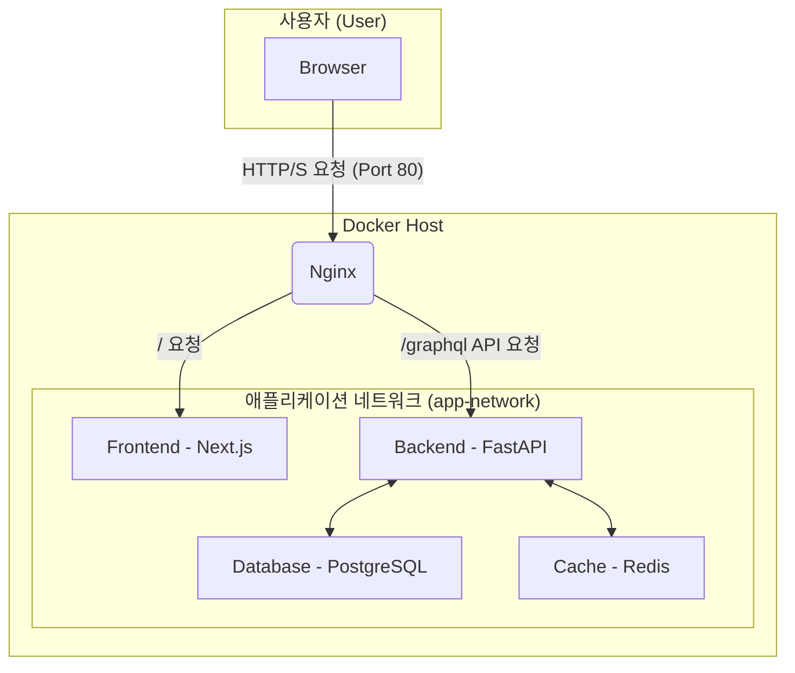

# 🐳 Docker & Docker Compose 배포 가이드

이 문서는 Docker와 Docker Compose를 사용하여 전체 애플리케이션 스택을 배포하는 방법을 안내합니다.

## 🧩 1. 아키텍처 개요

이 프로젝트는 Docker Compose를 통해 여러 컨테이너를 한번에 관리하는 MSA(Microservice Architecture) 구조를 따릅니다.


*   **Nginx**: 모든 외부 요청을 수신하는 리버스 프록시 서버입니다.
*   **Frontend**: Next.js로 구현된 UI입니다. 포트 3000번을 사용합니다.
*   **Backend**: Python FastAPI로 구현된 GraphQL API 서버입니다. 포트 8000번을 사용합니다.
*   **Database**: PostgreSQL 데이터베이스입니다.
*   **Redis**: 캐싱 또는 세션 관리를 위한 인메모리 데이터 저장소입니다.

모든 서비스는 `app-network`라는 가상 네트워크 내에서 서로 통신하며, 외부에서는 Nginx를 통해서만 애플리케이션에 접근할 수 있습니다.

---

## ⚙️ 2. 사전 준비

배포를 진행하기 전, 아래 두 가지가 반드시 설치되어 있어야 합니다.

*   [Docker](https://docs.docker.com/get-docker/)
*   [Docker Compose](https://docs.docker.com/compose/install/)

또한, 환경변수 설정을 위해 `Database` 디렉토리 안에 `.env` 파일을 생성해야 합니다. 프로젝트 루트의 `.env-sample` 파일을 복사하여 사용하세요.

```bash
# PowerShell 또는 cmd
copy .\.env-sample .\Database\.env

# bash
cp ./.env-sample ./Database/.env
```

`Database/.env` 파일 내용은 아래와 같아야 합니다.

```env
# ./Database/.env
POSTGRES_DB=your_db_name
POSTGRES_USER=your_user
POSTGRES_PASSWORD=your_password
DATABASE_URL="postgresql://your_user:your_password@db:5432/your_db_name"
```

---

## 🚀 3. 빌드 및 실행

프로젝트 루트 디렉토리에서 아래 명령어를 실행하면 모든 서비스가 빌드되고 백그라운드에서 실행됩니다.

```bash
docker compose up --build -d
```

-   `--build`: 이미지를 새로 빌드합니다. 소스 코드가 변경되었을 때 사용합니다.
-   `-d`: 컨테이너를 백그라운드에서 실행합니다.

## ✅ 4. 서비스 확인

-   **웹 애플리케이션**: 브라우저에서 `http://localhost` 로 접속합니다.
-   **GraphQL API**: `http://localhost/graphql` 로 접속하여 API 문서를 확인할 수 있습니다.

---

## ⏹️ 5. 서비스 종료

애플리케이션을 종료하려면 아래 명령어를 사용합니다.

```bash
docker compose down
```

-   컨테이너와 네트워크를 모두 중지하고 삭제합니다.
-   데이터베이스 데이터를 유지하려면 `docker compose down -v`를 사용하지 마세요. (`db_data` 볼륨이 삭제됩니다.)

---

## 🗂️ 6. 주요 파일 설명

-   `docker-compose.yml`: 서비스의 구성과 관계를 정의합니다.
-   `BackEnd/python/employee_fastapi_graphQL/Dockerfile`: Python 백엔드 서버의 Docker 이미지를 생성합니다.
-   `FrontEnd/Nextjs/ts_employ_graphql/Dockerfile`: Next.js 프론트엔드 서버의 Docker 이미지를 생성합니다.
-   `Infra/nginx/nginx.conf`: Nginx의 요청 라우팅 규칙을 정의합니다.
