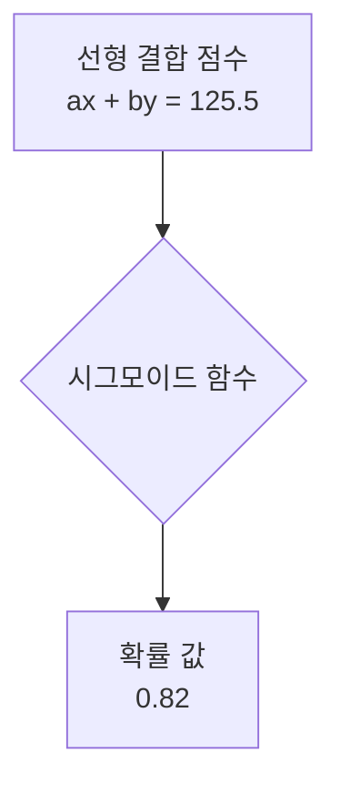

# AI 입문자를 위한 통합 가이드
> 이 문서는 `@파이토치.md`와 `@📘 AI·딥러닝 입문자를 위한 핵심 개념 총정리.md`의 내용을 통합하고, 비전공자 학습자의 시선에 맞춰 **"Why → What → How → Advanced"** 의 흐름으로 재구성한 최종 정리본입니다.

---

## 1. 시작하며: 왜 AI는 특별한 엔진을 필요로 하는가? (GPU & TPU)

AI, 특히 딥러닝의 본질은 **대규모 행렬(Matrix) 연산의 반복**입니다. 우리가 상상하는 복잡한 추론 과정 이면에는 단순한 곱셈과 덧셈이 상상할 수 없는 횟수로 일어나고 있습니다. 이 계산을 누가 더 빠르고 효율적으로 처리하느냐가 AI 기술의 핵심이며, 이것이 바로 GPU가 주목받는 이유입니다.

<br>

**GPU는 AI의 “엔진”** 역할을 합니다. CPU가 복잡한 논리 연산을 순서대로 처리하는 뇌의 '지성'이라면, GPU는 수천 개의 단순 계산을 동시에 처리하는 '근육'에 가깝습니다.

| 구분 | **CPU (Central Processing Unit)** | **GPU (Graphics Processing Unit)** | **TPU (Tensor Processing Unit)** |
| --- | --- | --- | --- |
| **코어 구조** | 소수의 고성능 코어 (4~16개) | 수천 개의 단순 코어 | AI 연산 전용 초병렬 구조 |
| **작업 방식** | 직렬 처리, 복잡한 연산에 강함 | 병렬 처리, 단순 반복 연산에 강함 | 행렬(Tensor) 연산에 극도로 최적화 |
| **주요 용도** | 운영체제, 일반 소프트웨어 | 그래픽 렌더링, **AI 학습/추론** | 대규모 AI 모델 학습 (구글) |
| **전력 효율** | 낮음 | 중간 | **매우 높음** |

<br>

> **핵심:** 딥러닝은 결국 수많은 행렬 곱셈입니다. 이 단순하고 반복적인 계산은 **병렬 처리**에 특화된 GPU에게 압도적으로 유리합니다. 이것이 AI 연구와 개발에 고사양 GPU가 필수적인 이유입니다.

---

## 2. 모든 것의 시작: 데이터, 행렬, 그리고 계산의 언어

AI의 엔진이 GPU라면, AI의 '연료'는 바로 **데이터**입니다. AI는 데이터를 먹고 패턴을 학습합니다.

### 2.1. 데이터: 점과 축으로 세상을 표현하기

`iris_analyst.py`에서 `iris.data`를 출력했던 것을 기억해 봅시다.

```python
# iris.data의 일부
# [[5.1 3.5 1.4 0.2]
#  [4.9 3.  1.4 0.2]
#  ...
#  [5.9 3.  5.1 1.8]]
```

이 숫자 배열이 바로 AI가 세상을 이해하는 방식입니다. "국어와 수학 점수" 예시처럼, 각 데이터는 여러 **축(차원)** 으로 구성된 공간의 한 **점**으로 표현됩니다.

- **특징 (Feature)**: 데이터를 설명하는 각각의 축(열).
    - Iris 데이터에서는 `sepal length (cm)`, `sepal width (cm)` 등 4개의 특징이 있었습니다. 이 특징들이 4차원 공간의 축이 됩니다.
- **라벨 (Label)**: 우리가 맞추고 싶은 '정답'.
    - Iris 데이터에서는 `setosa`, `versicolor` 등 붓꽃의 품종이 라벨입니다. AI는 4개의 특징 값을 보고 이 품종을 맞추도록 학습됩니다.

### 2.2. 선형대수: AI 계산의 언어

AI가 데이터를 처리할 때 사용하는 언어가 바로 **선형대수(Linear Algebra)** 입니다.

- **벡터(Vector)**: 방향과 크기를 가진 숫자 묶음입니다. 한 학생의 `(국어 점수, 수학 점수)`나 한 붓꽃의 `(꽃받침 길이, 꽃받침 너비, 꽃잎 길이, 꽃잎 너비)`가 하나의 벡터가 됩니다.
- **행렬(Matrix)**: 이런 벡터들을 여러 개 모아놓은 숫자 배열입니다. `iris.data`의 `(150, 4)` 모양 행렬은 150개의 붓꽃 데이터(벡터)를 모아놓은 것입니다.

```mermaid
flowchart LR
    A[데이터 포인트 1<br>(붓꽃 1송이)] --> C{벡터<br>[5.1, 3.5, 1.4, 0.2]};
    B[데이터 포인트 2<br>(붓꽃 2송이)] --> D{벡터<br>[4.9, 3.0, 1.4, 0.2]};
    C --> F[행렬<br>데이터셋];
    D --> F;
    E[...] --> F;
```
> 📝 **요약:** 여러 데이터 포인트(벡터)가 모여 하나의 행렬(데이터셋)을 구성합니다.


**왜 필요할까요?**
여러 특징들을 조합하여 종합적인 판단을 내리기 위해서입니다. 예를 들어 "합격 점수"를 계산할 때, 단순히 점수를 더하는 게 아니라 중요도에 따라 **가중치(weight)**를 곱해서 합산합니다.

> **종합 점수 = (a * 국어 점수) + (b * 수학 점수)**

이 식이 바로 선형대수의 가장 기본적인 표현이며, AI 모델 내부에서 일어나는 핵심 계산입니다.

---

## 3. 데이터 속 관계 파헤치기: 통계의 눈

데이터가 주어졌을 때, AI는 이 숫자들 속에서 어떤 패턴과 관계를 찾아낼까요? 그 관계를 분석하는 도구가 바로 **통계**입니다.

### 3.1. 데이터의 힘과 퍼짐: 분산(Variance)

**분산**은 데이터가 평균으로부터 얼마나 널리 퍼져 있는지를 나타내는 값입니다.

- **분산이 크다**: 데이터들이 평균에서 멀리 떨어져 있고, 값의 범위가 넓습니다. 이는 해당 특징이 다양한 값을 가지며, 구별되는 정보를 많이 담고 있을 가능성이 높다는 의미입니다. 즉, **데이터의 '힘' 또는 '에너지'가 강하다**고 해석할 수 있습니다.
- **분산이 작다**: 데이터들이 평균 근처에 옹기종기 모여 있습니다. 해당 특징의 영향력이 상대적으로 작다고 볼 수 있습니다.

### 3.2. 함께 움직이는 경향: 공분산(Covariance)

**공분산**은 두 개의 특징(변수)이 얼마나 '함께' 움직이는지를 측정하는 값입니다.

- **공분산이 양수**: 한 특징이 증가할 때 다른 특징도 증가하는 경향이 있습니다. (예: 키와 몸무게)
- **공분산이 음수**: 한 특징이 증가할 때 다른 특징은 감소하는 경향이 있습니다. (예: 공부 시간과 게임 시간)
- **공분산이 0에 가까움**: 두 특징은 서로 별다른 관계없이 독립적으로 움직입니다.

#### ❗ **가장 중요한 오해 바로잡기: `X.T @ X`는 공분산이 아니다!**

`iris_analyst.py`에서 `X.T @ X`를 계산했습니다. 이것은 **공분산 행렬이 아닙니다.**

- **`X.T @ X`의 정체**: **그램 행렬(Gram matrix)**. 각 특징 벡터끼리의 **내적(Inner Product)** 결과로, 데이터의 원초적 관계를 나타내지만 평균이 보정되지 않았습니다.
- **'진짜' 공분산 행렬**: **평균을 제거(mean-centering)** 하는 과정이 반드시 필요합니다. '함께 움직인다'는 것은 '평균'을 기준으로 변동하는 것을 의미하기 때문입니다.

```python
import numpy as np

# X는 iris.data (150, 4) 행렬
# 1. 각 특징(열)의 평균을 구합니다.
mean_vector = np.mean(X, axis=0)

# 2. 원본 X의 모든 값에서 각 열의 평균을 빼줍니다.
centered_X = X - mean_vector

# 3. 이 '평균이 제거된' 행렬을 가지고 계산해야 진짜 공분산 행렬이 나옵니다.
# (N-1로 나누는 것은 통계적 정확성을 위한 것입니다.)
Cov_matrix = (centered_X.T @ centered_X) / (len(X) - 1)
```

```mermaid
flowchart TD
    A[원본 데이터 행렬 X] --> B{평균 계산<br>np.mean(X)};
    A --> C[평균 제거<br>X - 평균];
    B --> C;
    C --> D{전치 행렬과 곱셈<br>centered_X.T @ centered_X};
    D --> E[공분산 행렬<br>N-1로 나누기];
```
> 📝 **요약:** 정확한 공분산 행렬을 계산하기 위해서는 반드시 데이터의 평균을 먼저 제거해야 합니다.

**공분산 행렬**을 보면, **대각선에는 각 특징의 분산**이, **대각선 외의 위치에는 특징 간의 공분산**이 위치하게 됩니다. 이를 통해 데이터의 전반적인 구조를 파악할 수 있습니다.

### 3.3. 공정한 비교를 위한 준비: 정규화와 표준화

공분산에는 치명적인 약점이 있습니다. 바로 **단위(scale)에 따라 값이 크게 달라진다**는 것입니다. 예를 들어 국어(100점 만점)와 수학(50점 만점)의 공분산을 계산하면, 값의 범위가 더 큰 국어 점수가 관계성을 왜곡할 수 있습니다.

이처럼 "비교를 공정하게" 만들기 위한 과정이 **정규화**와 **표준화**입니다.

| 기법 | **표준화 (Standardization)** | **정규화 (Normalization)** |
| --- | --- | --- |
| **정의** | 평균 0, 표준편차 1로 변환 | 모든 값을 0 ~ 1 사이로 변환 |
| **수식** | `z = (x - 평균) / 표준편차` | `x' = (x - 최소값) / (최대값 - 최소값)` |
| **목적** | 데이터의 분포 형태를 유지한 채 **상대적 위치 비교**에 유리. 이상치(outlier)에 덜 민감. | 데이터의 절대적 크기를 특정 범위로 맞춰야 할 때 유리. 이상치에 민감. |

#### 💡 **코사인과 사인: 숨겨진 자동 정규화**

어떤 2차원 데이터 `(x, y)`를 '각도'로 표현하면 어떻게 될까요? 벡터를 각도 `θ`로 표현하면, 그 좌표는 `(cosθ, sinθ)`가 됩니다. 이 점은 반지름이 1인 **단위원(Unit Circle)** 위에 있으며, `cos²θ + sin²θ = 1` 이므로 **벡터의 길이가 항상 1로 자동 정규화**됩니다.

이것이 바로 **코사인 유사도(Cosine Similarity)**의 핵심 원리입니다. 데이터의 절대적인 크기를 무시하고, 순수하게 **방향성만으로 유사도를 측정**할 수 있게 됩니다.

### 3.4. 진짜 관계의 강도: 상관계수(Correlation Coefficient)

**상관계수**는 공분산의 '단위 문제'를 해결한 최종판입니다. 공분산을 각 특징의 표준편차로 나누어 정규화한 값입니다.

> **상관계수 (ρ) = Cov(X, Y) / (σ_X * σ_Y)**

```mermaid
flowchart TD
    A[공분산 행렬<br>(단위 문제 존재)] --> B{각 특징의<br>표준편차 계산};
    A --> C[상관계수 행렬<br>(단위 문제 해결)];
    B --> C;
```
> 📝 **요약:** 공분산을 각 데이터의 표준편차로 나누어주면 단위 문제가 해결된 상관계수를 얻을 수 있습니다.

- 항상 **-1과 +1 사이의 값**을 가집니다.
- **+1**에 가까우면 완벽한 양의 선형 관계, **-1**에 가까우면 완벽한 음의 선형 관계, **0**에 가까우면 관계가 없음을 의미합니다.
- 단위에 영향을 받지 않으므로, AI 모델의 **'가중치'와 가장 유사한 개념**으로 해석할 수 있는 '진짜 관계의 강도'입니다.

---

## 4. 예측 모델의 탄생: 확률과 학습

### 4.1. 예측을 확률로 바꾸기: 시그모이드 함수와 확률

선형대수를 통해 `(a * 국어) + (b * 수학)` 같은 점수를 계산했지만, 우리는 "합격/불합격"처럼 명확한 판정을 내리거나 "합격 확률 80%"처럼 확률적 예측을 하고 싶습니다. 하지만 선형식의 결과는 음수가 될 수도, 100을 훌쩍 넘을 수도 있어 확률로 해석하기 어렵습니다.

이때 등장하는 것이 **시그모이드(Sigmoid) 함수**입니다.

> **σ(x) = 1 / (1 + e⁻ˣ)**

시그모이드 함수는 어떤 실수 값이든 입력받아 **0과 1 사이의 값으로 압축**시켜주는 S자 모양의 곡선입니다.


> 📝 **요약:** 시그모이드 함수는 선형 모델의 결과(실수)를 0과 1 사이의 확률 값으로 변환합니다.

- **선형 결합 결과**(`ax + by`)를 시그모이드 함수에 넣으면, 그 결과는 0~1 사이의 값이 되어 **확률처럼 해석**할 수 있게 됩니다.
- 입력값이 매우 크면 1에, 매우 작으면 0에 가까워집니다.
- 이는 통계학에서 특정 값 이하가 나올 누적 확률을 나타내는 **누적분포함수(CDF)** 와 모양이 매우 유사하며, "어떤 사건이 일어날 확률"을 모델링하는 데 자연스럽게 사용되었습니다.

### 4.2. 통계 vs. 딥러닝: AI는 어떻게 정답을 찾아가는가?

> **"AI는 이 힘(분산)과 연결성(공분산)을 직접 쓰지 않고, 수많은 1차 함수를 실행하면서 학습을 통해 가중치를 스스로 계산한다."**

이 문장이 통계와 AI의 근본적인 차이를 설명하는 핵심입니다.

- **통계적 접근**: 데이터로부터 상관계수와 같은 관계의 강도를 **한 번에 계산**하여 모델을 만듭니다.
- **딥러닝(AI) 접근**:
    1. 일단 수많은 가중치(1차 함수의 기울기)를 **무작위로 초기화**합니다.
    2. 현재 가중치로 예측을 수행합니다.
    3. 예측값과 실제 정답(라벨)의 차이인 **오차(Error / Loss)**를 계산합니다.
    4. 이 오차를 줄이는 방향으로 **가중치를 아주 조금씩 수정**합니다. (이 과정을 **역전파(Backpropagation)** 라고 합니다.)
    5. 위 과정을 모든 데이터에 대해 수없이 반복하며 최적의 가중치를 **스스로 찾아갑니다.** (이 반복 과정을 **학습(Training)** 이라고 합니다.)

```mermaid
flowchart TD
    A[1. 예측 수행<br>(현재 가중치 사용)] --> B[2. 오차 계산<br>(예측값 vs 정답)];
    B --> C[3. 가중치 수정<br>(오차를 줄이는 방향으로)];
    C --> A;
```
> 📝 **요약:** 딥러닝은 '예측 → 오차 계산 → 가중치 수정' 과정을 반복하며 스스로 최적의 해를 찾아갑니다.

> **결론**: AI는 관계를 분석하여 공식을 만드는 것이 아니라, 수많은 시도를 통해 **스스로 정답에 가까워지는 공식(가중치 집합)을 만들어내는 시스템**입니다.

---

## 5. AI의 학습 패러다임: 세 가지 방법

AI가 학습하는 방식은 크게 '정답'의 유무와 '보상' 시스템에 따라 세 가지로 나뉩니다.

```mermaid
flowchart TD
    A{데이터에<br>정답(라벨)이 있는가?};
    A -- Yes --> B[지도 학습<br>분류, 회귀];
    A -- No --> C[비지도 학습<br>군집화, 차원축소];
```
> 📝 **요약:** 학습 방식은 정답(라벨)의 유무에 따라 지도 학습과 비지도 학습으로 나뉩니다.


### 5.1. 지도 학습 (Supervised Learning)

- **정의**: **입력 데이터와 정답(라벨)이 함께 있는** 데이터셋으로 학습합니다.
- **목표**: 새로운 데이터가 들어왔을 때, 그 데이터의 정답을 정확히 예측하는 것.
- **종류**:
    - **분류 (Classification)**: 데이터가 어떤 카테고리에 속하는지 맞추는 문제. (예: 붓꽃 품종 맞추기, 스팸 메일 분류)
    - **회귀 (Regression)**: 연속적인 숫자를 예측하는 문제. (예: 주가 예측, 집값 예측)

### 5.2. 비지도 학습 (Unsupervised Learning)

- **정의**: **정답(라벨)이 없는** 데이터로 학습합니다.
- **목표**: 데이터 자체의 숨겨진 구조, 패턴, 유사성을 발견하는 것.
- **종류**:
    - **군집화 (Clustering)**: 비슷한 데이터끼리 그룹으로 묶는 것. (예: 고객 유형 분석)
    - **차원 축소 (Dimensionality Reduction)**: 데이터의 본질적인 구조는 유지하면서, 여러 개의 특징(고차원)을 소수의 핵심 특징(저차원)으로 요약하는 것.

### 5.3. 강화 학습 (Reinforcement Learning)

- **정의**: 정답 대신 **보상(Reward)**을 통해 학습합니다.
- **목표**: 주어진 환경(Environment)에서 에이전트(Agent)가 행동(Action)을 취했을 때, 미래에 받을 **보상을 최대화**하는 최적의 행동 전략(Policy)을 학습하는 것.
- **예시**: 알파고(바둑), 자율주행 자동차, 게임 AI

---

## 6. 심화 기술: 복잡한 데이터를 다루는 법

### 6.1. 차원 축소: 데이터의 본질만 남기기

데이터의 특징(차원)이 수십, 수백 개로 늘어나면 계산이 복잡해지고, '차원의 저주'라는 문제에 빠져 모델 성능이 오히려 저하될 수 있습니다. 이때 데이터의 본질은 유지하며 차원을 줄이는 **차원 축소** 기법이 사용됩니다.

| 기법 | **PCA (주성분 분석)** | **LDA (선형 판별 분석)** | **SVD (특이값 분해)** |
| --- | --- | --- |
| **목표** | 데이터의 **분산(퍼짐)**이 가장 큰 방향으로 새로운 축(주성분)을 찾아 데이터를 투영. | 클래스(라벨) 간의 **분리**를 최대화하는 방향으로 새로운 축을 찾아 데이터를 투영. | 행렬을 세 개의 다른 행렬로 분해하는 순수 수학적 기법. |
| **학습** | **비지도 학습** (라벨 불필요) | **지도 학습** (라벨 필요) | - |
| **주용도** | 데이터 시각화, 특징 추출 | 분류 성능 강화를 위한 특징 추출 | PCA의 수학적 기반, 추천 시스템 등 |

### 6.2. 자연어 처리(NLP): 글자를 숫자로 바꾸기

지금까지 다룬 기술들은 모두 '숫자'로 된 데이터를 가정했습니다. 그렇다면 "사과", "사랑" 같은 글자는 어떻게 AI가 이해할까요?

**자연어 처리(Natural Language Processing)**의 핵심은 **단어를 벡터로 변환(Vectorization)**하는 것입니다. 이를 **임베딩(Embedding)**이라고 합니다.

```mermaid
flowchart TD
    A[텍스트 데이터<br>"AI는 재미있다"] --> B{임베딩<br>(단어 → 벡터)};
    B --> C[벡터 데이터<br>[[0.1, 0.8..], [0.4, 0.2..]]];
    C --> D[머신러닝 모델 입력];
```
> 📝 **요약:** 자연어 처리는 텍스트를 벡터로 변환하여 AI가 이해할 수 있는 형태로 만드는 과정입니다.

- **원리**: 비슷한 의미를 가진 단어는 벡터 공간에서 가까운 위치에, 다른 의미를 가진 단어는 먼 위치에 매핑합니다. (예: "왕" - "남자" + "여자" ≈ "여왕")
- **결과**: "사과"라는 단어가 `[0.2, 0.7, 0.1, ...]` 과 같은 수치 벡터로 변환됩니다.
- **의의**: 텍스트 데이터가 숫자 벡터로 바뀌면, 위에서 설명한 모든 머신러닝/딥러닝 기술을 동일하게 적용할 수 있게 됩니다.

---

## 7. 더 깊은 이야기: 알아두면 좋은 개념들

- **중심값 이론 (Central Limit Theorem)**: "어떤 분포를 따르는 데이터든, 그 데이터에서 추출한 표본들의 평균은 정규분포에 가까워진다"는 통계학의 근본 원리입니다. 데이터가 결국 평균으로 수렴하려는 경향성을 설명합니다.
- **내적 (Inner Product)**: 두 벡터의 유사성을 측정하는 기본 연산입니다. 두 벡터의 방향이 비슷할수록 내적 값은 커집니다. 코사인 유사도는 내적을 정규화한 것입니다.
- **피벗팅 (Pivoting)**: 데이터 분석에서 '관점'을 바꾸어 데이터를 재배치하는 기술입니다. (예: '학생별 점수' 테이블을 '과목별 평균' 테이블로 변환)
- **위상수학 (Topology)**: 데이터의 고차원적인 '형태'와 '연결 구조'를 연구하는 수학 분야입니다. 데이터가 구멍 뚫린 도넛 모양인지, 공 모양인지 등을 파악하여 숨겨진 특성을 발견하는 데 사용됩니다.
